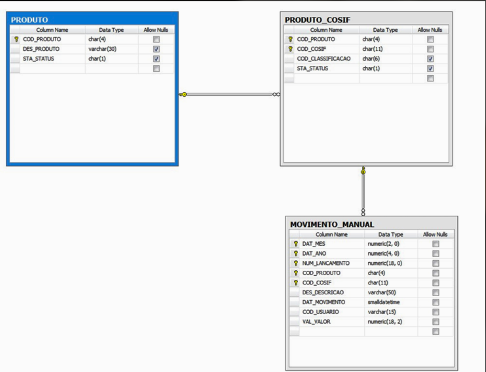

# CHALLENGE BNP ANTLIA

## Description:

Use the template below, respecting the cardinality, the primary and foreign keys, and also the data type. The tables "
Product" and "PRODUCT_COSIF" can be considered as domain data, and therefore some records can be manually inserted in
order to facilitate the movement insertion tests.
NOTE: As I have a superficial knowledge of the Oracle database I adapted the data for the PostgreSQL database.

## Prerequisites

- **[Required]** [Kotlin](https://kotlinlang.org/)
- **[Required]** [Gradle](https://gradle.org/)
- **[Required]** [PostgreSQL](https://www.postgresql.org/)
- **[Required]** [Spring Boot](https://spring.io/projects/spring-boot)
- **[Required]** [Docker](https://www.docker.com/): As this project is dockerized.
- **[Required]** [Docker-Compose](https://docs.docker.com/compose/): To run project with its dependencies
- **[Required]** [JDK 18](https://www.oracle.com/java/technologies/downloads/#java18)
- **[Required]** [React Js](https://pt-br.reactjs.org/)
- **[Required]** [Node Js 16.15.1](https://nodejs.org/en/download/)